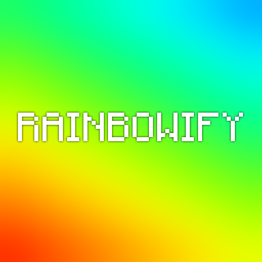

# rainbowify

rainbowify is a Fabric mod for Minecraft 1.17 that adds a customizable rainbow
background to many Minecraft HUDs.

Although the main feature of the mod is adding a rainbow gradient background to HUDs, there also is a blur option, which delivers a much better frame time than other solutions, even making it compatible and fluent with older GPUs.
If you don't like the rainbow gradient you can simply disable it in the options and only use the blur backdrop.

Discord: https://discord.gg/Ka2yV5MkFw 
Modrinth: https://modrinth.com/mod/rainbowify

## Installation

We take a working Fabric installation for granted. Have a look at the
[Fabric website](https://fabricmc.net/) if you haven't installed it yet.

Simply drag the mod into your `mods` folder. You must have the
[Fabric API](https://modrinth.com/mod/fabric-api) installed the same way. We
recommend also using [Modmenu](https://modrinth.com/mod/modmenu) (for editing
rainbowify's settings ingame). rainbowify is compatible with
[Sodium](https://modrinth.com/mod/sodium), so you may want to use that as well
for improved performance.

## Customization

In the mod menu rainbowify settings, you can customize multiple values:

* **Rainbowify:** Enables/disables the mod.
* **Blur**: Enables/disables the blur in GUI backgrounds. If you notice any stutters in the GUI, turn this off.
* **Rainbow**: Enables/disables the rainbow gradient in GUI backgrounds. 
* **Blur amount**: How large the blur radius will be. The higher this setting, the less recognizable the background will be.
* **Rainbow opacity**: How opaque the rainbow colors will be.
* **Rainbow speed**: How fast the rainbow colors will move.

## Development Setup

1. Clone this project `git clone https://github.com/officialLennox/rainbowify`
2. Open the project in IntelliJ as gradle project
3. Execute the `genSources` gradle task
4. Build the jar with the `assemble` gradle task

### Code Conventions
We use Google Code Conventions with 2 spacings, please keep that in mind while contributing.

## License

Copyright (c) 2021-2022 Lennox

rainbowify is free software: you can redistribute it and/or modify
it under the terms of the GNU General Public License as published by
the Free Software Foundation, either version 3 of the License, or
(at your option) any later version.

rainbowify is distributed in the hope that it will be useful,
but WITHOUT ANY WARRANTY; without even the implied warranty of
MERCHANTABILITY or FITNESS FOR A PARTICULAR PURPOSE.  See the
GNU General Public License for more details.

You should have received a copy of the GNU General Public License
along with rainbowify.  If not, see <https://www.gnu.org/licenses/>.
